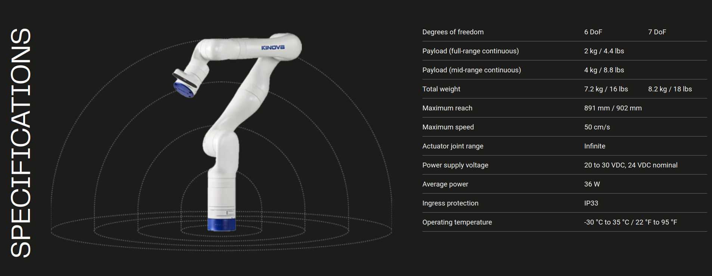

MoveIt2 tutorial link : https://moveit.picknik.ai/main/doc/tutorials/quickstart_in_rviz/quickstart_in_rviz_tutorial.html  
This video shows the result of this tutorial : https://youtu.be/_MleyL1h8V0  
The robot is Kinova Gen 3 
  
The main topics are :  
* Step 1: Launch the Demo and Configure the Plugin  
* Step 2: Play with the Visualized Robots  
* Step 3: Interact with the Kinova Gen 3  
--- Moving into collision  
--- Moving out of Reachable Workspace  
--- Moving Joints or in Null Space  
* Step 4: Use Motion Planning with the Kinova Gen 3  
--- Introspecting Trajectory Waypoints  
--- Plan Cartesian motions  
--- Executing Trajectories, Adjusting Speed  
* RViz Visual Tools   
* Saving Your Configuration  
